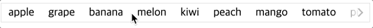

# react-overflow-wrapper
A React component that scrolls horizontally if the list is overflow.

[](https://nodei.co/npm/react-overflow-wrapper/)

[](https://www.npmjs.com/package/react-overflow-wrapper)
[](https://www.npmjs.com/package/react-overflow-wrapper)
[](https://coveralls.io/github/lannex/react-overflow-wrapper?branch=master)
[](https://www.npmjs.com/package/react-overflow-wrapper)
[](https://github.com/prettier/prettier)
[](https://www.npmjs.com/package/react-overflow-wrapper)



## Install
```
$ npm install react-overflow-wrapper
```
```
$ yarn add react-overflow-wrapper
```

## Usage
```js
import OverflowWrapper from 'react-overflow-wrapper';

<OverflowWrapper>
 {
   // some items
 }
</OverflowWrapper>

```

## Props
#### `children`: React.ReactNode
- isRequired
- default: `undefined`

#### `className`: string
- default: `undefined`

#### `style`: object
- default: `undefined`

#### `iconSize`: number
- default: `26`

#### `iconColor`: string
- default: `#aeb6bb`

#### `iconWrapStyle`: object
- default: 
  ```
  { 
    left: { 
      backgroundImage: 'linear-gradient(to right, hsl(0, 100%, 100%) 25%, 
      hsla(0, 0%, 0%, 0))', 
    }, 
    right: { 
      backgroundImage: 'linear-gradient(to left, hsl(0, 100%, 100%) 25%, 
      hsla(0, 0%, 0%, 0))', 
    }, 
  }
  ```

#### `iconStyle`: object
- default: 
  ```
  {
    left: {},
    right: {},
  }
  ```

#### `hideIcons`: boolean
- default: `false`

#### `leftIcon`: React.ReactNode
- default: `undefined`

#### `rightIcon`: React.ReactNode
- default: `undefined`

## Browser support
Tested with modern browsers.

## License
the MIT license.
